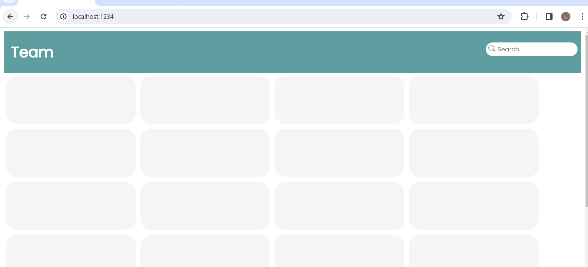

# Team Directory

# Team Directory page contents
* Header
  1. Title
  2. Search Bar
* Body
  1. Admin Container Section
  2. Member Container Section
    $ Admin/Member Card has
      1. Image of the user
      2. Full Name of user
      3. User Email

# Detailng done in the application
  1. Entire Application has font family text of "Poppins" 
  2. Color coding is done as per the given UI/UX.
  3. Created a pointer animation when navigated on User data.
  4. Dummy icon or image is added for the profile photo of the user.
  5. API is generated and the link is https://72a031db589a4980b12a016fda46e56b.api.mockbin.io/
  6. Used fetch(), async(), await() methods to interact and get data from API.
  7. On initial load of the page, until data is reterived from API, we are showing a shimmer(duplicate) UI on the page.
  8. React hooks useState() and useEffetct() is used to manage the state and re-rendering of the page.
  9. Added responsiveness for the web page.

# To execute the app locally
  1. Clone the repo "https://github.com/kruKruthi/react-courses.git" in local.
  2. Navigate to branch: "cdw-team-directory" where the code exists for Team Directory.
  3. Do npm install, npm start to start local server.
  4. On browser trigger "http://localhost:1234" to view the Team Directory wep bage.

# Screenshot of the working app from local
  1. Shimmer UI on page load
    

